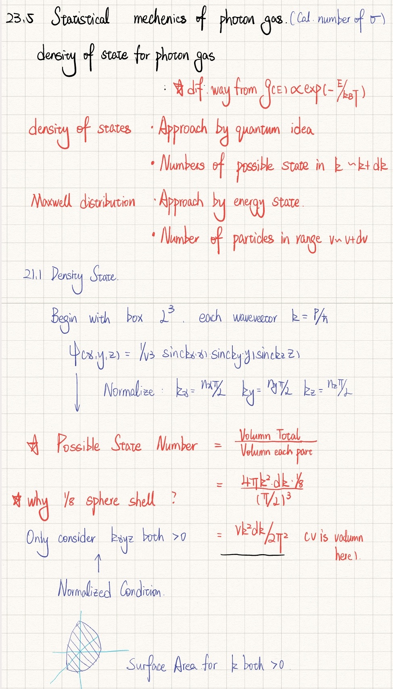

# ⚛️ UCL Physics Year 1 - The "Deep Dive" Notes

  

> "I learned very early the difference between knowing the name of something and knowing something." — Richard Feynman
> "Physics is like sex: sure, it may give some practical results, but that's not why we do it." — Richard Feynman

## 🚧 Project Status: Active & Updating
**This repository is a Work In Progress (WIP).** I am currently updating notes module by module. Please **Star ⭐** or **Watch 👁️** this repository to get notified when new chapters are uploaded!

---

## 📖 About These Notes
This is not just a summary of the slides. This is a complete reconstruction of the UCL Year 1 Physics curriculum, written with a focus on **first-principles derivation** and **comprehensive extension**.

### Why use these notes?
* **📐 Complete Derivations (全过程推导):**
    * Every single formula appearing in Lecture PPTs and Reading Assignments is derived from scratch.
    * No "magic steps" skipped. I bridge the gaps that professors often leave out.
* **🌌 Massive Extensions (超大量拓展):**
    * Contains supplementary knowledge and mathematical context that goes beyond the syllabus but is crucial for a deep understanding of physics.
* **✍️ Handwriting Aesthetics:**
    * Created in Notability. Designed to be visually structured for logical flow.

## 🗺️ Roadmap & Progress (更新进度)
*Check back often to see new modules!*
> **📢 Quality Notice regarding Week 1-5:**
> Please note that **PHAS0004 (Weeks 1-5)** and **Math (Weeks 1-5)** are currently uploaded as **scanned paper notes**. The quality is not yet optimal. I am currently remastering them into the high-quality **digital handwritten format** (same standard as Week 6 & 7) and will upload the improved versions soon. Thanks for your patience!

**PHAS0004: Atoms, Stars and the Universe**
  - [ ] Week 1
  - [ ] Week 2
  - [ ] Week 3
  - [ ] Week 4
  - [ ] Week 5
  - [x] Week 6
  - [x] Week 7
  - [ ] Week 8
  - [ ] Week 9
  - [ ] Week 10
  - [ ] Week 11
  - [ ] Week 12

**Mathematical Methods 1**
  - [x] Week 1
  - [x] Week 2
  - [x] Week 3
  - [x] Week 4
  - [x] Week 5
  - [ ] Week 6
  - [ ] Week 7
  - [ ] Week 8
  - [ ] Week 9
  - [ ] Week 10
  - [ ] Week 11
  - [ ] Week 12

## 🖼️ Preview (Sneak Peek)
*(Below is an example of a full derivation page)*

## ⚠️ Disclaimer
These are my personal study notes. While I strive for rigor, they are unofficial. The "extensions" part may cover topics slightly outside the standard exam scope but are intended for enthusiasts.
## 🤝 Contact
If you find these notes helpful, or if you spot an error, feel free to reach out!
* **Connect with me:** Wechat:13701067904 Whatsapp:7344099424

---
*Maintained by a UCL Physics Student. Fighting for the Truth of Physics.*
