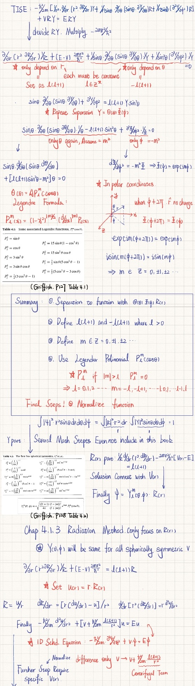

# UCL Physics MSci: Advanced Lecture Notes & Independent Derivations (Year 1)

## 📖 Project Overview

This repository hosts a comprehensive collection of rigorous physics notes, original derivations, and Python simulations developed during my first year of the MSci Physics programme at University College London (UCL).

**This is not merely a transcription of lecture slides.** The goal of this project is to **bridge the gap** between the standard undergraduate curriculum and graduate-level theoretical frameworks. Each module is treated as a research subject, synthesizing insights from standard textbooks with independent mathematical expansions.

> **Core Philosophy:** Every equation is derived from first principles. No result is accepted without a rigorous proof.

---

## 📚 The "Four Pillars" Foundation

The notes in this repository are heavily expanded and cross-referenced with the standard "Big Four" undergraduate texts. I have moved beyond the syllabus to include **complete proofs, edge cases, and alternative formulations** found in:

| Subject | Core Reference Text | Key Expansions in Notes |
| :--- | :--- | :--- |
| **Classical Mechanics** | **David Morin**, *Introduction to Classical Mechanics* | Lagrangian formalism basics, non-inertial reference frames, and rigorous oscillation analysis. |
| **Quantum Mechanics** | **D.J. Griffiths**, *Introduction to Quantum Mechanics* | Full derivation of the Schrödinger equation solutions, operator formalism, and Hilbert space intro. |
| **Electrodynamics** | **D.J. Griffiths**, *Introduction to Electrodynamics* | Vector calculus identities proofs, multipole expansion details, and potential theory. |
| **Thermal Physics** | **Blundell & Blundell**, *Concepts in Thermal Physics* | Microstate counting, partition function derivations, and statistical mechanic foundations. |

---
---

## 📄 Notes Preview & Derivations

To demonstrate the rigor applied to my studies, below are sample pages from my notebooks. These excerpts showcase independent derivations of key results found in *Sakurai* and *Landau*, going beyond standard textbook summaries.

| **Excerpt 1: Thermal physics** | **Excerpt 2:  Quantum Formalism / Operator Algebra** |
| :---: | :---: |
|  |  |
| *Example of rigorous mathematical restructuring of standard theorems.* | *Detailed diagrammatic analysis and step-by-step proof.* |

---

## 🚀 Advanced Theoretical Track (In Progress)

Beyond the standard curriculum, I am currently documenting my self-study in advanced theoretical physics. These notes represent my transition to graduate-level formalism.

* **Analytical Mechanics:** Based on **L.D. Landau & E.M. Lifshitz**, *Mechanics (Vol. 1)*.
    * *Focus:* Least Action Principle, Conservation Laws, Small Oscillations.
* **Modern Quantum Mechanics:** Based on **J.J. Sakurai**, *Modern Quantum Mechanics*.
    * *Focus:* Dirac notation, Stern-Gerlach experiments, Bell's Inequality, and Time Evolution Operators.

---

## 📬 Contact

**[ChengxuLiu]** MSci Physics Undergraduate | University College London  
Email: [zcapiuk@ucl.ac.uk]
